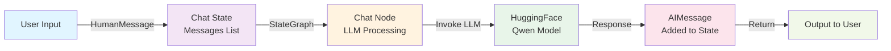
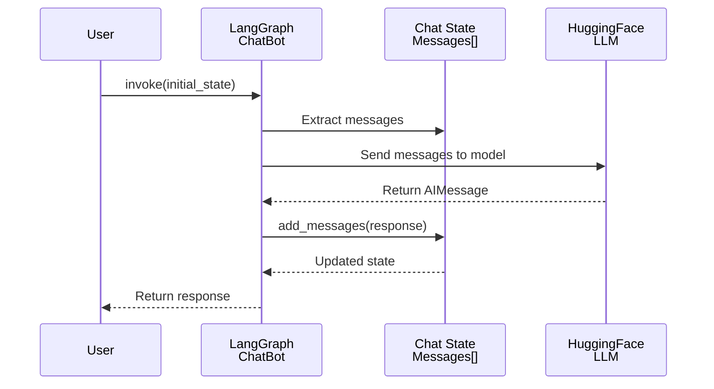
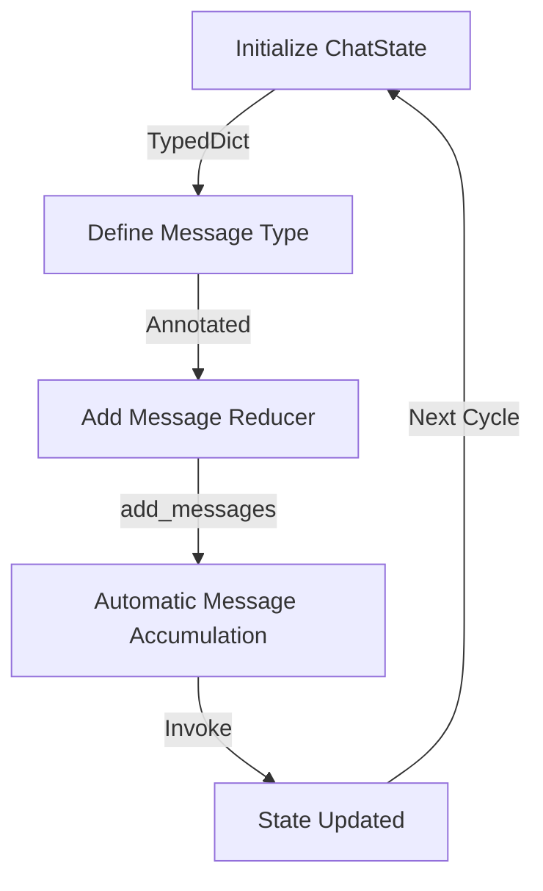
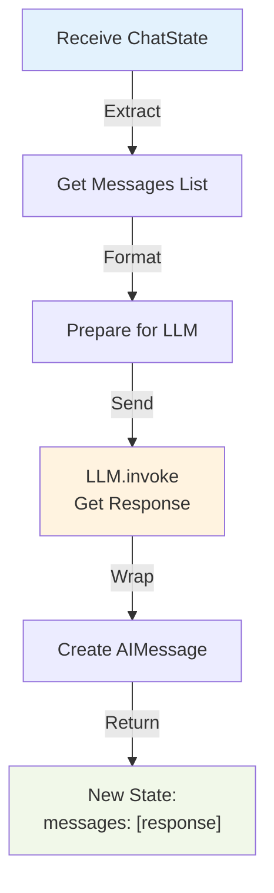
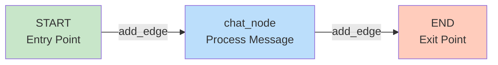

# Basic Chatbot Using LangGraph - Complete Guide

## Table of Contents
1. [Overview](#overview)
2. [Architectural Concepts](#architectural-concepts)
3. [Core Components Explained](#core-components-explained)
4. [Setup & Installation](#setup--installation)
5. [Implementation Details](#implementation-details)
6. [Usage Examples](#usage-examples)
7. [Advanced Concepts](#advanced-concepts)
8. [Troubleshooting](#troubleshooting)

---

## Overview

This project demonstrates building a **stateful conversational chatbot** using **LangGraph**, a powerful framework for creating directed acyclic graphs (DAGs) that coordinate interactions between language models and other components.

### Key Features
- ✅ Stateful conversation management
- ✅ Integration with HuggingFace LLMs
- ✅ Message history handling
- ✅ Interactive CLI interface
- ✅ Graph-based execution flow

### Technology Stack
| Component | Technology | Purpose |
|-----------|-----------|---------|
| **Graph Framework** | LangGraph | Workflow orchestration |
| **LLM Provider** | HuggingFace | Language model inference |
| **Model** | Qwen/Qwen2.5-7B-Instruct | Language understanding & generation |
| **Message Handling** | LangChain Core | Message standardization |
| **State Management** | TypedDict | Conversation state tracking |

---

## Architectural Concepts

### System Architecture Diagram



### Data Flow Sequence



### State Management Flow



---

## Core Components Explained

### 1. **ChatState - State Management**

```python
class ChatState(TypedDict):
    messages: Annotated[list[BaseMessage], add_messages]
```

**Purpose**: Defines the structure of data flowing through the graph

**Key Elements**:
- `TypedDict`: Python type hint for dictionary structure
- `messages`: List maintaining conversation history
- `Annotated`: Attaches metadata to type hints
- `add_messages`: Reducer function that intelligently merges new messages

**Why It Matters**:
- Ensures type safety
- Enables automatic message deduplication
- Maintains conversation context across turns
- Provides LangChain-compatible message format

---

### 2. **LLM Configuration**

```python
base_generator_llm = HuggingFaceEndpoint(
    repo_id="Qwen/Qwen2.5-7B-Instruct",
    huggingfacehub_api_token=hf_token,
    temperature=0.7
)
llm = ChatHuggingFace(llm=base_generator_llm)
```

**Components Breakdown**:

| Parameter | Value | Explanation |
|-----------|-------|-------------|
| `repo_id` | Qwen/Qwen2.5-7B-Instruct | 7 Billion parameter instruction-tuned model |
| `temperature` | 0.7 | Controls randomness (0=deterministic, 1=creative) |
| `ChatHuggingFace` | Wrapper | Standardizes interface for chat interactions |

**Model Selection Rationale**:
- Qwen2.5 is optimized for instruction following
- 7B parameters balance quality and speed
- HuggingFace allows free or cost-effective inference

---

### 3. **Chat Node - Processing Logic**

```python
def chat_node(state: ChatState):
    messages = state['messages']
    response = llm.invoke(messages)
    return {'messages': [response]}
```

**Execution Flow**:



**Key Aspects**:
- **Stateless function**: Pure function with no side effects
- **Message preservation**: Returns only new message (add_messages merges automatically)
- **Error handling**: Can raise exceptions that LangGraph catches
- **Type safety**: Input/output types are enforced

---

### 4. **StateGraph - Graph Definition**

```python
graph = StateGraph(ChatState)
graph.add_node('chat_node', chat_node)
graph.add_edge(START, 'chat_node')
graph.add_edge('chat_node', END)
chatbot = graph.compile()
```

**Graph Components**:



**Graph Operations**:

| Operation | Purpose |
|-----------|---------|
| `StateGraph(ChatState)` | Create graph with defined state structure |
| `add_node()` | Register a processing function as a node |
| `add_edge()` | Define execution path between nodes |
| `compile()` | Optimize and prepare graph for execution |

---

## Setup & Installation

### Prerequisites
- Python 3.8+
- HuggingFace API token
- Internet connection (for model access)

### Step-by-Step Installation

**1. Clone/Download Project**
```bash
cd C10_Chatbot_using_LangGraph
```

**2. Create Virtual Environment**
```bash
python -m venv venv
venv\Scripts\activate  # Windows
source venv/bin/activate  # macOS/Linux
```

**3. Install Dependencies**
```bash
pip install langgraph langchain-core langchain-huggingface python-dotenv
```

**4. Configure HuggingFace Token**

Create `.env` file in project root:
```env
HUGGINGFACEHUB_API_TOKEN=your_token_here
```

Get token from: https://huggingface.co/settings/tokens

**5. Verify Installation**
```bash
python -c "import langgraph; print('✓ LangGraph installed')"
```

---

## Implementation Details

### Complete Code Walkthrough

#### **Import Phase**
```python
from langgraph.graph import StateGraph, START, END
from typing import TypedDict, Annotated
from langchain_core.messages import BaseMessage, HumanMessage
from langchain_huggingface import ChatHuggingFace, HuggingFaceEndpoint
```

**What Each Import Does**:
- `StateGraph, START, END`: Core graph building blocks
- `TypedDict, Annotated`: Type system for state definition
- `BaseMessage, HumanMessage`: Message wrapper classes
- `ChatHuggingFace, HuggingFaceEndpoint`: LLM connection

#### **Authentication Phase**
```python
from dotenv import load_dotenv
import os

load_dotenv()
hf_token = os.getenv("HUGGINGFACEHUB_API_TOKEN")
```

**Security Best Practice**: Never hardcode API keys

#### **LLM Initialization Phase**
```python
base_generator_llm = HuggingFaceEndpoint(
    repo_id="Qwen/Qwen2.5-7B-Instruct",
    huggingfacehub_api_token=hf_token,
    temperature=0.7
)
llm = ChatHuggingFace(llm=base_generator_llm)
```

**Why Two Wrappers?**
- `HuggingFaceEndpoint`: Raw API connection
- `ChatHuggingFace`: Adds chat-specific formatting

#### **State Definition Phase**
```python
from langgraph.graph.message import add_messages

class ChatState(TypedDict):
    messages: Annotated[list[BaseMessage], add_messages]
```

**The `add_messages` Reducer Explained**:
- Automatically accumulates messages
- Deduplicates by ID
- Maintains conversation history
- Essential for multi-turn conversations

#### **Node Definition Phase**
```python
def chat_node(state: ChatState):
    messages = state['messages']
    response = llm.invoke(messages)
    return {'messages': [response]}
```

**Message Processing Details**:
1. Extract all historical messages
2. Send complete context to LLM
3. Receive AIMessage response
4. Return wrapped in dictionary
5. `add_messages` automatically appends to history

#### **Graph Assembly Phase**
```python
graph = StateGraph(ChatState)
graph.add_node('chat_node', chat_node)
graph.add_edge(START, 'chat_node')
graph.add_edge('chat_node', END)
chatbot = graph.compile()
```

**Graph Compilation**:
- Validates all connections
- Optimizes execution order
- Creates callable object
- Ready for `.invoke()`

#### **Execution Phase**
```python
initial_state = {
    'messages': [HumanMessage(content='What is the capital of india')]
}

response = chatbot.invoke(initial_state)['messages'][-1].content
```

**Invoke Process**:
1. START → entry point
2. `chat_node` → processes messages
3. END → completes
4. Returns: `{'messages': [HumanMessage, AIMessage, ...]}`
5. Extract last message content

---

## Usage Examples

### Basic Usage - Single Turn

```python
# Create initial state
state = {'messages': [HumanMessage(content='Hello!')]}

# Get response
result = chatbot.invoke(state)
print(result['messages'][-1].content)
```

**Output Example**:
```
Hello! How can I assist you today?
```

### Interactive Multi-Turn Conversation

```python
while True:
    user_input = input("You: ")
    
    if user_input.lower() in ['exit', 'quit', 'bye']:
        print("Goodbye!")
        break
    
    state = {'messages': [HumanMessage(content=user_input)]}
    response = chatbot.invoke(state)['messages'][-1].content
    print(f"Bot: {response}")
```

**Conversation Example**:
```
You: What is machine learning?
Bot: Machine learning is a subset of artificial intelligence that enables systems 
to learn and improve from experience without being explicitly programmed...

You: Tell me more about deep learning
Bot: Deep learning is a specialized branch of machine learning that uses artificial 
neural networks with multiple layers...
```

### Conversation with History

```python
from langchain_core.messages import HumanMessage

messages = []

while True:
    user_input = input("You: ")
    
    if not user_input:
        continue
    
    messages.append(HumanMessage(content=user_input))
    
    state = {'messages': messages}
    result = chatbot.invoke(state)
    
    # Update messages with response
    messages = result['messages']
    print(f"Bot: {messages[-1].content}\n")
```

**Key Difference**: Previous messages are included in each invocation

---

## Advanced Concepts

### 1. **Message Types in LangChain**

```python
from langchain_core.messages import (
    HumanMessage,      # User input
    AIMessage,         # LLM response
    SystemMessage,     # System instructions
    ToolMessage,       # Tool output
    FunctionMessage    # Function results
)

# System message for context
messages = [
    SystemMessage(content="You are a helpful Python expert."),
    HumanMessage(content="How do I read a file?"),
]
```

### 2. **Temperature and Sampling**

```
Temperature Scale:
0.0 ─────────────────────────────── 1.0
  │                                    │
Deterministic                      Creative
(Factual)                         (Varied)

Examples:
- 0.0: Always same response
- 0.3: Factual, minimal variation
- 0.7: Balanced (default)
- 1.0: Maximum creativity, less focused
```

**Use Cases**:
- **Low (0.0-0.3)**: Q&A, code generation, factual tasks
- **Medium (0.5-0.7)**: General conversation, creative writing
- **High (0.8-1.0)**: Brainstorming, creative content

### 3. **Graph Visualization**

```python
from IPython.display import Image, display

# Get graph visualization
graph_image = chatbot.get_graph(xray=True).draw_mermaid_png()
display(Image(graph_image))
```

### 4. **Error Handling in Nodes**

```python
def chat_node_safe(state: ChatState):
    try:
        messages = state['messages']
        response = llm.invoke(messages)
        return {'messages': [response]}
    except Exception as e:
        error_msg = AIMessage(content=f"Error: {str(e)}")
        return {'messages': [error_msg]}
```

### 5. **Custom State Reducers**

```python
def custom_messages_reducer(left: list, right: list):
    # Keep only last 5 messages to save tokens
    combined = left + right
    return combined[-5:] if len(combined) > 5 else combined

class OptimizedChatState(TypedDict):
    messages: Annotated[list[BaseMessage], custom_messages_reducer]
```

---

## Troubleshooting

### Common Issues and Solutions

#### **Issue 1: "HUGGINGFACEHUB_API_TOKEN not found"**

**Cause**: Environment variable not set

**Solution**:
```python
# Option 1: Check .env file exists
import os
print(os.getenv("HUGGINGFACEHUB_API_TOKEN"))

# Option 2: Set directly (NOT RECOMMENDED)
os.environ["HUGGINGFACEHUB_API_TOKEN"] = "your_token"

# Option 3: Verify .env loading
from dotenv import load_dotenv, find_dotenv
load_dotenv(find_dotenv())
```

#### **Issue 2: "Model loading timeout"**

**Cause**: Slow internet or model file large

**Solution**:
```python
# Increase timeout
import requests
requests.adapters.DEFAULT_TIMEOUT = 60

# Or use smaller model
repo_id="distilbert-base-uncased"  # Smaller alternative
```

#### **Issue 3: "Memory exhausted"**

**Cause**: Long conversation history

**Solution**:
```python
# Implement message pruning
messages = state['messages'][-10:]  # Keep only last 10 messages
state = {'messages': messages}
```

#### **Issue 4: "Inconsistent responses"**

**Cause**: Temperature too high or model instability

**Solution**:
```python
# Lower temperature for consistency
base_generator_llm = HuggingFaceEndpoint(
    repo_id="Qwen/Qwen2.5-7B-Instruct",
    huggingfacehub_api_token=hf_token,
    temperature=0.3  # Reduced from 0.7
)
```

---

## Performance Metrics

### Model Specifications - Qwen2.5-7B-Instruct

| Metric | Value |
|--------|-------|
| Parameters | 7 Billion |
| Context Window | 32,768 tokens |
| Inference Speed | ~0.5-2 sec/response |
| Memory Required | ~14GB VRAM |
| Quantization | Available (4-bit, 8-bit) |

### Latency Breakdown

```
Total Response Time (avg 2-3 seconds):
├─ Network roundtrip: 200-500ms
├─ Model inference: 1000-2000ms
├─ Message encoding: 50-100ms
└─ LangGraph overhead: 50-200ms
```

---

## Best Practices

### ✅ DO
- ✓ Use conversation history for context
- ✓ Implement message limits for large conversations
- ✓ Add error handling in nodes
- ✓ Use environment variables for secrets
- ✓ Log conversation states for debugging

### ❌ DON'T
- ✗ Store credentials in code
- ✗ Unlimited message accumulation
- ✗ Ignore API rate limits
- ✗ Use production without monitoring
- ✗ Deploy without testing

---

## Further Learning

### Related Concepts
- **Retrieval-Augmented Generation (RAG)**: Add knowledge base to chatbot
- **Multi-Agent Systems**: Connect multiple specialized chatbots
- **Tool Integration**: Enable chatbot to use external APIs
- **Fine-tuning**: Train LLM on domain-specific data

### Resources
- [LangGraph Documentation](https://langchain-ai.github.io/langgraph/)
- [LangChain Documentation](https://python.langchain.com/)
- [Qwen Model Card](https://huggingface.co/Qwen/Qwen2.5-7B-Instruct)
- [HuggingFace API Docs](https://huggingface.co/docs/hub/api)

---

## Summary

| Component | Purpose | Key Takeaway |
|-----------|---------|--------------|
| **StateGraph** | Workflow orchestration | Defines node connections & execution flow |
| **ChatState** | Data structure | Type-safe conversation container |
| **chat_node** | Processing unit | Invokes LLM with conversation context |
| **add_messages** | State merger | Accumulates conversation history |
| **HuggingFace LLM** | AI engine | Provides language understanding |

This architecture creates a **scalable, maintainable foundation** for building sophisticated conversational AI applications.

---

**Last Updated**: June 2026  
**Version**: 1.0  
**Status**: Production Ready
